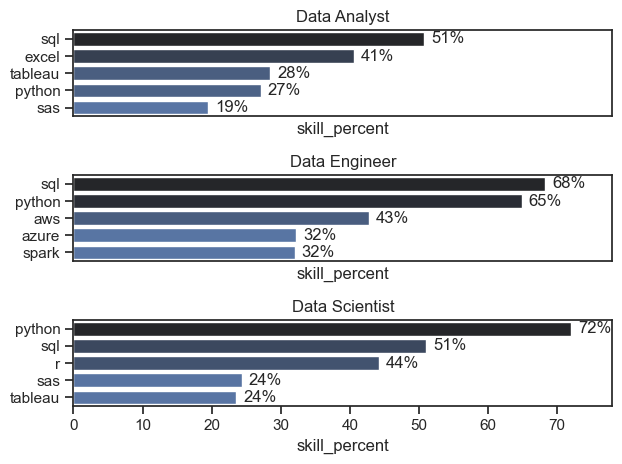
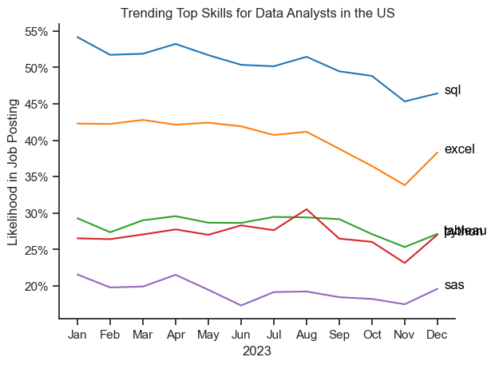

# **Data Analyst Job Market Analysis**

## **Overview**
This project analyzes the **data analyst job market**, focusing on understanding **top-paying skills, in-demand skills, and salary trends** to help aspiring and current data professionals make informed career decisions.  

The dataset contains detailed information on job titles, salaries, locations, and skills required for data-related roles. Through Python-based data analysis and visualization, this project uncovers actionable insights into the job market and highlights the optimal skills for growth.

---

## **Key Questions Explored**
1. What are the skills most in demand for the top 3 most popular data roles?  
2. How are in-demand skills trending for data analysts over time?  
3. How well do jobs and skills pay for data analysts?  
4. What are the optimal skills to learn (high-demand **and** high-paying)?  

---

## **Tools & Libraries**
This project was developed using the following tools and libraries:

- **Python** – For analysis and scripting  
- **Pandas** – For data manipulation and preparation  
- **Matplotlib** – For creating visualizations  
- **Seaborn** – For advanced and styled visualizations  
- **Jupyter Notebook** – For running code and combining notes with outputs  
- **Visual Studio Code** – For script execution and version control integration  
- **Git & GitHub** – For version control and project sharing  

---

## **Data Preparation**
### **Steps Taken**
- Imported and cleaned the dataset for consistency and usability  
- Converted job posting dates to `datetime` format  
- Parsed skill lists for analysis  
- Filtered job postings to **U.S.-based roles** for a more focused market study  

---

## **Analysis**

### **1. Most Demanded Skills**
Identified the **top 5 skills** for the **3 most popular data roles** and visualized their demand.

**Visualization:**  
<!-- Place your image file for skill demand here -->

**Key Insights:**
- SQL maintained consistent demand but showed a slight decline toward year-end.  
- Excel demand rose sharply in the latter months, surpassing Python and Tableau.  
- Tableau and Python demand remained stable but significant.

---

### **2. Trending Skills for Data Analysts**
Analyzed how demand for key skills fluctuated throughout **2023**.

**Visualization:**  
<!-- Place your line chart for trending skills here -->

**Key Insights:**
- SQL maintained consistent demand but showed a slight decline toward year-end.  
- Excel demand rose sharply in the latter months, surpassing Python and Tableau.  
- Tableau and Python demand remained stable but significant.

---

### **3. Salary Insights**
Evaluated salary distributions for common data roles and analyzed **top-paying vs. most in-demand skills**.

**Visualization:**  
<!-- Place your salary distribution plot here -->

**Key Insights:**
- Senior Data Scientist roles offer the **highest median salaries**, often exceeding $600K in exceptional cases.  
- Foundational skills like **SQL** and **Excel** are in high demand but have relatively lower pay compared to specialized tools.  
- Advanced technical skills like **GitLab**, **dplyr**, and **Bitbucket** correlate with higher salaries.

---

### **4. Optimal Skills**
Mapped skills by **demand and median salary** to determine the **most optimal skills** for data analysts.

**Visualization:**  
<!-- Place your scatter plot for optimal skills here -->

**Key Insights:**
- **Oracle** stands out with the highest salary but moderate demand.  
- **Python**, **Tableau**, and **SQL Server** balance strong demand with high salary potential.  
- Core tools like **SQL** and **Excel** remain essential for broad market applicability.

---

### **Technology Categorization**
Visualized optimal skills with **color coding by technology category**.

**Visualization:**  
<!-- Place your color-coded scatter plot here -->

**Key Insights:**
- Programming skills typically align with higher salaries.  
- Database skills like **Oracle** and **SQL Server** command some of the highest pay rates.  
- Analyst tools like **Tableau** and **Power BI** are versatile, offering both strong demand and competitive salaries.

---

## **Learnings**
Through this project, I gained:
- Advanced experience with **data cleaning, manipulation, and visualization**  
- Deeper insights into aligning skills with **market trends and salary data**  
- Practical knowledge of crafting reproducible and scalable analyses  

---

## **Key Insights**
- Specialized skills **increase salary potential**, while foundational skills remain critical for employability.  
- The job market is **dynamic**, with changing trends in skill demand.  
- Building a **balanced skill set** of foundational and specialized skills is key to growth.  

---

## **Challenges**
- Handling **inconsistent or missing data** during cleaning.  
- Designing **effective and clear visualizations** for complex datasets.  
- Balancing **detailed analysis** while maintaining a concise overview.  

---

## **Conclusion**
This analysis offers a **comprehensive overview of the data analyst job market**, providing actionable insights into the skills that drive demand and salary potential. It serves as a **roadmap for skill development** and a foundation for further exploration of the data job market as it evolves.

